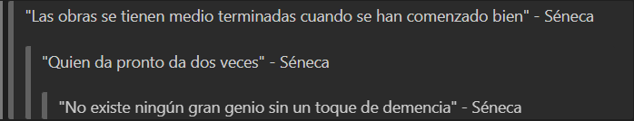

# 📑***MARKDOWN*** ----------------------------- 📑
***  
>## ***↪ Qué es Markdown?***  🧐


|_⟫  Markdown (MD) es un lenguaje de marcado simple que posibilita la manipulación de texto plano ☝🏾🤓. ⟪_|  |  
|:-:|-------------:|  
***  
>## ***↪ Para qué se utiliza***❓
|Ej. img. | _↪ Da formato a los ficheros con texto de forma sencilla y legible, comúnmente en entornos en línea mediante carácteres tales como puntos, asteriscos, slash..._|Ej: Blogs, Foros, Documentaciones... |  
|:----|:---:|:---|  

>## ↪ ***Sintaxis de MD*** 📏

***↪ La sintaxis de MD es el conjunto de  reglas y convenciones usadas para dar el formato que buscamos al texto. Cuáles són? A continuación te explico cómo hacercada una:***  
 
      
- ## ***Título*** 🪧
  ```  
  # ESTO ES UN TEXTO DE EJEMPL  
  ## ESTO ES UN TEXTO DE EJEMPLO  
  ### ESTO ES UN TEXTO DE EJEMPLO  
  #### ESTO ES UN TEXTO DE EJEMPLO  
  ##### ESTO ES UN TEXTO DE EJEMPLO
  ```
  →  🤯 _Se definen títulos y/o secciones mediante hashtags(#). Mientras más hashtags ponemos más pequeño se hace el texto (De 1 a 5)._

  <details> 
  <summary>💡Ejemplo de título</summary>  

    

</details>  

- ##  ***Saltos de línea ↪✏️***   
    
  →  _Para poder efectuar un salto de línea se debe realizar un doble espaciado + Enter como en el segundo ejemplo, en caso de no hacerlo se vería como en el primer ejemplo._  

- ## ***Comentarios***  💭  
  _Hay distintas formas de hacer un comentario❗_ 
  ```  
  👉🏾  Deben ir solos sin texto cercano:
     1.  [//]: # (Comentario que debe ir solo)
     2.  [comment]: <> (Comentario que debe ir solo)
     3.  [//]: <> (Comentario que debe ir solo) 
     4.  <!--Comentario  
     multilínea  
     que debe ir solo-->

  👉🏾  Pueden ir acompañados de un texto:
     1.  <!--Comentario que puede ir o no solo-->
  ```   
  → _Sirven para comentar en la consola que no quieres que se visible fuera de la edición MD_    

  <details> 
  <summary>💡 Ejemplos de cómo hacer comentarios </summary>   
  
  ***
    

   ***
   _→  🚫 Lo que muestra la imagen es cómo **NO** se debe usar un comentario que no debe ir acompañado de texto, a consecuencia de esto no solo se muestra el comentario en la consola, si no también en el documento._
   ***
     
   ***
   _→  Aquí se muestra cómo debe ser el comentario._  
   </details>  
   
   ***
- ## ***Negrita*** ⬛
  **→ Si lo que quieres es poner tu texto en negrita como este, te lo enseño en un periquete**🫡 **. Elige la palabra o texto que quieras transformar, pon dos asteriscos al inicio y otros dos en el rabete.**
  >“Ba Dum Tssss🥁”    
  

  _También lo puedes hacer con dos guiónes bajos a cada lado del texto._
  
  ``` 
    **Este es un ejemplo de texto**  
    __Este es un ejemplo de texto__
  ```  
  ***  
 - ## ***Cursiva*** 🐛  
 
   (Para hacer este punto no usaré la letra anterior para que puedas ver la diferencia entre texto normal y cursiva.)  

   → 🤓 Si lo que queremos es poner en cursiva nuestro texto usaremos un asterizco a cada lado o un barra baja a cada lado
   ```  
      *Este es un ejemplo de texto*  
      _Este es un ejemplo de texto_
   ``` 
   ***   
- ## ***Cursiva y negrita*** 🐛⬛ 
  
  ***→ ¿Cómo hacemos cursiva y negrita juntas?_ 🤔 _En este caso usamos tres asteriscos a cada lado del texto o tres guiones bajos a cada lado:***
   ```  
   ***Este es un ejemplo de texto***
   ___Este es un ejemplo de texto___
   ```  
   
    <details>
    <summary> Resultado </summary> 
      
      
    
    </details>  
    
    ***  
- ## ***Citas*** 🔡  
  → _A la hora de hacer una cita en markdown tenemos que usar el signo más grande que(>), en caso de que sean varias debemos ir subiendo la cantidad de veces que usamos el signo_ 😉. 

      >"Las obras se tienen medio terminadas cuando se han comenzado bien" - Séneca  
      >> "Quien da pronto da dos veces" - Séneca*  
      >>> "No existe ningún gran genio sin un toque de demencia" - Séneca  

  > *Séneca fue un escritor, filósofo y orador romano. ☝🏾🤓 
    <details>
    <summary> Resultado </summary> 
      
      
    
    </details>  

    ***  
- ## ***Listas*** 📋  
    → _Si deseas hacer una lista con números debes empezar por el número y luego añadir un punto_ .  

        1. Este es un texto de ejemplo.  
        2. Este es un texto de ejemplo.  
        3. Este es un texto de ejemplo  
        4. Este es un texto de ejemplo.  
   → Otra forma de hacer listas es con puntos, usando asterisos, guiones o el signo más:  

        - Este es un texto de ejemplo.  
        - Este es un texto de ejemplo.  
  <details>
    <summary> Resultado con números </summary>  

    

    
    </details>   
  <details>
    <summary> Resultado con puntos </summary>  
    
    
    
    </details>  

    ***  
  >Fuente:  
  >>https://medium.com/@davidbernalgonzalez/3-markdown-c82d88c1d222
  >>>_-David Bernal Gonzalez_


